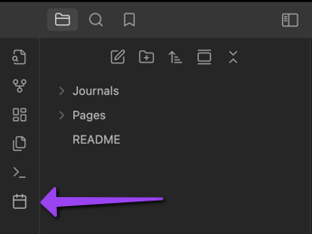
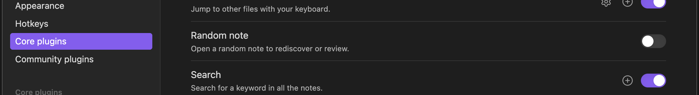

# Take better developer notes with Obsidian.md
This post is for software developers who don't currently think much about their notes.
You may take notes, but don't think of it as a "note taking system", and have probably never heard the term "Personal Knowledge Management".

I have 3 goals with this post
1. Convince you that you should start a note taking system
2. Explain why I recommend Obsidian specifically for that purpose
3. Provide some tips to help you get started creating your system in Obsidian

<!-- truncate -->

## Why you should start a note taking system for yourself

Maybe you head to Google when you want to find the article you know you read that one time.
Maybe you take notes in a physical notebook, but rarely look over them because finding anything means flipping through dozens of pages to find the one you want.
Maybe you have a handful of gigantic notes in Apple Notes, or Google Keep titled things like "How to deploy $SERVICE", with code blocks of commands to run, and you can usually find things as long as you know the name of the note and roughly where in the note the info you need is.

Regardless, you don't think much about your notes so your approach to them is ad hoc.
By being more systemic and intentional with your notes, and especially by turning your miscellaneous, disconnected notes into something akin to a personal wiki, with links between notes, they will start to work for you in ways they weren't before.

The goal here is not to remember everything you ever wrote down; rather, the goal is to be able to find important information later, freeing you from having to consciously remember.
Linking notes together provides more ways to find the note ("I can't remember what I called my note on X, but I know I referenced it from Y").

This doesn't have to be complicated.
Even a simple system (and you should definitely start with a simple system) will make it much easier to find information later on, which will encourage you to write more notes, creating a nice feedback loop.
The notes themselves can be simple too. Sometimes a few bullet points is enough to jog your memory, like a pointer to your brain.

You may _remember_ less, but you will _recall_ more.

## Why use Obsidian specifically?

At it's core, Obsidian lets you turn a folder full of Markdown files into a local wiki.
Obsidian's term for this is "vault".

:::tip
Obsidian has a command pallet (`⌘+p` on Mac, presumably `Ctrl+p` on Windows and Linux).
You can use it to explore what features are available.
You can also view and change all hotkeys from the "Hotkeys" section of the settings panel.
:::

### Local, plaint text

Storing your notes in plaintext, locally means you own your data, and avoid vendor lock-in.
Even if Obsidian went defunct tomorrow, you still own your notes, and there are plenty of other Markdown editors, including those that support creating a wiki.

### Obsidian-flavored markdown

Obsidian has the nicest Markdown editor I've ever used, including a Live Preview mode that shows the Markdown code for the block you're editing, and the rendered version otherwise.[^compare-vscode]
Out of the box, Obsidian Markdown is most similar to GitHub Markdown, with a few additional syntax extensions. The most important of those extensions are wikilinks, and inline tags.

[^compare-vscode]: for comparison, in VSCode, you have to open a separate Preview Mode, and either switch between them or open a Split Panel view to see both at the same time. You can do the same in Obsidian, but it doesn't force you to.
#### Wiki links

Say you have a note file `<root>/Programming/Java/String Interpolation in Java.md`, and you want to link to it from  `<root>/Programming/String Interpolation.md`
Standard Markdown links take the form `[display text](url or relative file path)`, so linking to the same note would look like `[String Interpolation in Java](./Java/String Interpolation in Java.md)`. That's not terrible when you're building a website, but it's clumsy when you are trying to capture notes.

Wikilinks are a simpler link format based on 2 presumptions (neither are strictly required, but it will be less friction to follow them):

1. most of your notes will have filenames that match the title of the note
2. most notes will have unique file names regardless of which folder they are in.

With wiki links, the syntax is `[[String Interpolation in Java]]`.
You can even link to notes that don't exist yet, and create them just by clicking on the link.
Additionally, as soon as you type `[[`, Obsidian will bring up an autocomplete style list of all notes in your vault.

#### Tags

In addition to wiki links and folder structure, Obsidian also supports organizing your notes using tags.
You can set these tags either in the `tags` front matter property at the top of the file, or you can set them inline by prefixing the tag name with a hash sign e.g. `#Meetings`.
In Live Preview, the tags will become a link that when clicked will search your entire notes folder for notes with that tag.

### Wiki features

Obsidian has 2 big features that help surface the wiki / knowledge graph aspect of the software: backlinks, and the graph view.

A backlink[^backlinks-are-like-pingbacks] (or sometimes "incoming link") is a link from another note to the current note.
For example, if `A.md` has a link `[[B]]`, then when looking at `B.md`, `A` is a backlink.
You can see these backlinks at the bottom of each note (requires enabling a setting, described below), or in a sidebar panel.
In addition to showing existing backlinks, these views also have an "Unlinked Mentions" section, which shows all notes which contain the current note name in their text.
For example, if you had a dev log note with the line I need to review how string interpolation in Java works, then Obsidian will highlight the string interpolation in Java part of the text and provide a button to create the link for you, changing that line to I need to review how [[string interpolation in Java]] works.
There is also an Outgoing Links sidebar panel, which lists (Outgoing) Unlinked Mentions.

[^backlinks-are-like-pingbacks]: it's kind of like Pingbacks in Wordpress

The Graph View displays each note as a node, with links between them.
You can filter by a search query[^search-query], recolor groups of nodes based on search queries and toggle whether to show tags and or attachments.

[^search-query]: See the _Search_ panel in the left sidebar to see how to write these queries.

There are two versions of the graph view.
The _Local Graph View_ shows the graph for current file and linked notes.

_Global Graph View_ shows your entire vault. This view is used as a selling point of Obsidian, and similar software. Many people consider it a gimmick so YMMV. I find it most useful for analyzing clusters of notes. For example, below is the global graph for my personal vault. I've circled a small cluster that doesn't link to anything outside the cluster. I may want to review those at some point for missing links. (And I definitely want to do that for all the notes around the rim that don't connect to anything at all.)

## Start building your system in Obsidian

You can download Obsidian from [their website](https://obsidian.md/).

A fresh installation of Obsidian can be overwhelming, so I want recommend a few settings and a lightweight workflow to get you started.
Your notes system and the notes therein are personal, intended to serve _your needs_, not someone else's, so any guidance I give will be general.
Maybe you don't like the folder structure or workflow that I recommend. That's okay. Feel free to ignore or change anything that doesn't work for you.
The point is to keep it simple at the start, and only add additional complexity when you need to.

> A complex system that works is invariably found to have evolved from a simple system that worked. A complex system designed from scratch never works and cannot be patched up to make it work. You have to start over with a working simple system.
>
> -- John Gall (1975) _Systemantics: How Systems Really Work and How They Fail_ p. 71[^galls-law-wikipedia]

[^galls-law-wikipedia]: [John Gall (author) § Gall's Law](https://en.wikipedia.org/wiki/John_Gall_(author)#Galls_law) on _Wikipedia_

### Folder structure and configuration

We're building the foundation now, so we are going to stick built in features and core plugins.
There are many useful community plugins, but I recommend ignoring them while you're getting started, as it's very easy to end up spending more time _configuring_ Obsidian than _using_ it.
We are also going to keep the folder structure simple, with just two folders `Journals` and `Pages`.[^this-is-not-para]

[^this-is-not-para]: This is not actually the structure that I use. I use a modified version of the PARA method. The PARA Method deserves it's own post, which I plan to write soon. In the meantime: we are keeping it simple.

#### Daily Notes Core Plugin

The Daily Notes core plugin makes creating daily note trivial.
It is enabled by default.
Open settings for the plugin and set "Date Format" to `YYYY/YYYY-MM-DD` and "New File Location" to `Journals`.

Now you can click the "Open today's daily note" button on the left sidebar to open today's note, even if it hasn't been created yet

#### Backlinks Core Plugin

Open the settings for the Backlinks plugin, and toggle on the setting "Show backlinks at the bottom of notes"

#### Random Note Core Plugin

The Random Note is not enabled by default, so enabled it under "Core Plugins"

The are no additional settings. This will add a die icon to the left sidebar that when clicked will open a random note in your vault.

### Daily Notes Workflow

This workflow is based primarily around taking one note per day, and extracting additional notes as needed.
Oftentimes, knowing roughly when you took a note can help you find it later. Daily notes are a simple way to achieve that.

#### Daily Notes

Using a single note per day saves you the hassle of figuring out where to put a note: it goes in the daily note, always.
Put everything in your daily note: meeting minutes, dev logs for your current ticket, your thoughts on articles you read that day, miscellaneous tasks, whatever.
Separate the topics with headings, or bullet lists, or horizontal rules or whatever feels natural.

#### Extracting new notes

You can leave these notes in the daily notes for some time, but eventually you will find yourself referring to the same note, or have your notes on a topic spread across multiple daily notes that you want to consolidate.
At that point, extract that section into their own note under the `Pages` folder, and leave behind a link to that note in any daily notes you sourced it from.
That way you can still find it by the date you took, but can also find it by name

#### Periodic review

Occasionally, you should perform maintenance on your notes in the form of a periodic review.
This could be in the form of a weekly review that you stick on your calendar, or more ad hoc, like occasionally clicking the "Random Note" button when the mood strikes you.

While reviewing a note, there are few things to consider:
- **Are there any notes you want to link to from this note, or vice versa?** Use the Backlinks (especially the Unlinked Mentions section) to help here.
- **Do you still understand the note?** A common piece of advice for ensuring you understand a concept is to explain it to someone else, because it will expose the gaps in your knowledge. In this case, that someone else is "you in 6 months".
- **Are there passages that stand out as important?** That would jog your memory when you see this note again? Add `... **bold** ...` or `... ==highlight== ...` to make them standout.

Doing this exercise will help solidify the knowledge in your brain, and the connections to other notes, making it easier to find the information in the future.[^reminder-of-existence]

[^reminder-of-existence]: sometimes just having a reminder that you already have a note on a topic can save a ton of time, because you think to check your notes first, rather than going to google.

## Conclusion

I hope this was helpful.
I have a few other posts planned about note taking in Obsidian.
For now though, just remember: start simple, review and edit your notes; and let complexity emerge organically.

Good luck!
